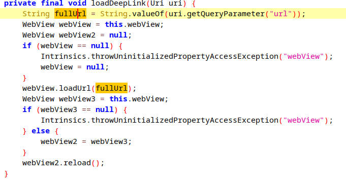

Задание - [Guess Me - Android Deep Link Challeng](https://www.mobilehackinglab.com/path-player?courseid=lab-guess-me&unit=65e1afbced31b6fd760c23ecUnit)
Приложение на эксплуатацию уязвимости в диплинке.

Основной функционал приложения - это игра для угадывания случайного числа с 10ю попытками, но основной интерес вызывает кнопка с информацией about.

Сама игра - это MainActivity, отображение информации about происходит с помощью WebView в WebviewActivity. 

**WebViewActivity**
Активность является экспортируемой, кроме этого, ее вызов возможен с помощью диплинка `mhl://mobilehackinglab`, который принимает параметр `url`, значение которого затем будет загружено в WebView:



Но загрузка url произойдет только в том случае, когда диплинк пройдет прверкку методом `isValidDeeplink()`, который содержит три проверки:
- схема равна `mhl` или `https`
- хост равен `mobilehackinglab`
- зачение url параметра оканчивается на `mobilehackinglab.com`
Обычный функционал этой активности - отображение `index.html` файла из ресурсов приложения с информацией about:


Интерес вызывает то, что у WebView включено выполнение js кода, а так же используется javascript интерфейс `AndroidBridge`:


у него определено два метода:


Уязвимым является второй метод `getTime()`, который принимает на вход строку, которая затем будет выполнена как команда ОС через функцию `exec()`, что обеспечивает уязвимость RCE.

Пример уязвимого диплинка, который выведен значение любой команды на экран:
```
am start -a android.intent.action.VIEW -d "mhl://mobilehackinglab?url=javascript:alert(AndroidBridge.getTime('command'));mobilehackinglab.com"
```

Пример вызова команды ls:


Конечно же, RCE позволяет в худшем случае прокинуть реверс шелл. По другому, эту уязвимость проэксплуатировать, захостив html с js кодом, использующим этот js интерфейс, и передавать адрес к этому ресурсу в диплинке, ну а диплинк можно использовать, к примеру, в атакующем приложении, ведь эта активность экспортируема.


