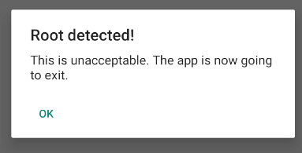

Задание - [Android UnCrackable L1](https://mas.owasp.org/crackmes/Android/)
В первую очередь, при запуске, сразу видим проверку на root окружение:



пробую обходить с помощью objection:
```
objection -g owasp.mstg.uncrackable1 explore --startup-command "android root disable"
```

Но это не позволяет обойти проверку. Нужно анализировать исходный код:


Реализовано три простых проверки, причем последние две точно будут возвращать false:
- В первом случае `tags` = `dev-keys`
- Во втором, всех файлов нет

Вывод - почему то objection не позволяет обойти проверку. Попробую с помощью frida:
```
frida -U --codeshare dzonerzy/fridantiroot -f owasp.mstg.uncrackable1
```

Root проверка успешно пройдена, еще есть проверка на дебаг, но я не запускал приложение в дебаге.

**Проверка строки:**
Строчка проверяется с захардкоженной строкой, зашифрованной в AES ECB, сама строка и ключ для дешифрования которые тоже захардкожены:


**Ответ:**
```
I want to believe
```

В принципе, это можно было решить и статическим анализом, и даже просто с помощью MobSF:


